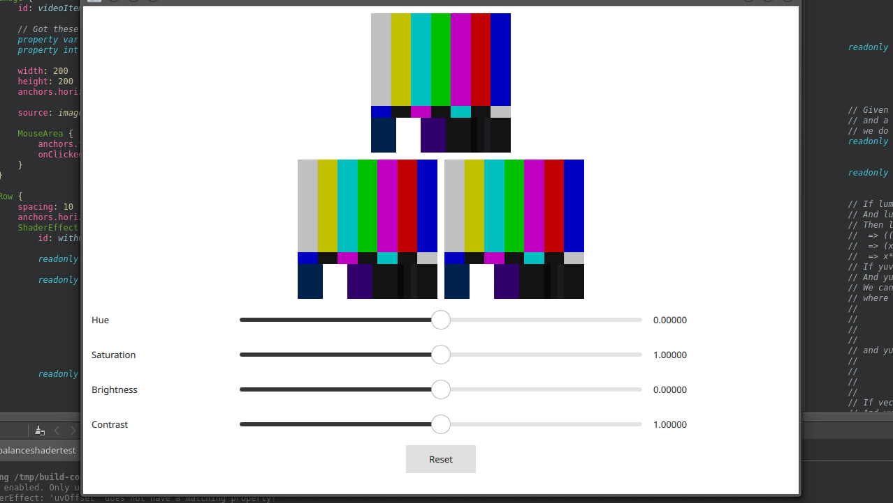

# colorbalanceshadertest/

A Little Application to test out various approaches to colorbalanceshadertest



## Requirements

* Qt5, including some development packages

## Installation

    $ cd colorbalanceshadertest/
    $ mkdir build && cd build
    $ qmake ..
    $ make

## Usage
```
  $ ./colorbalanceshadertest
```
